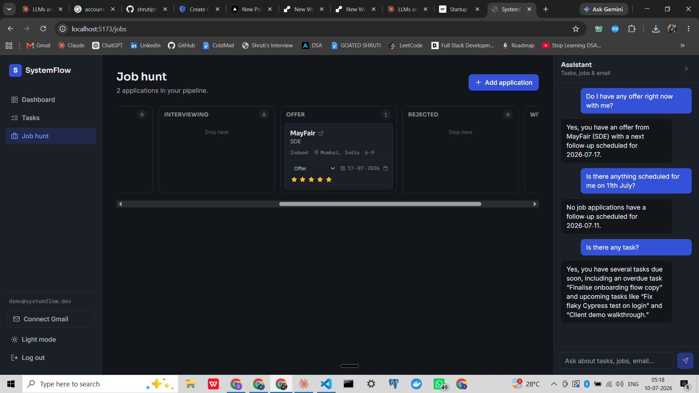
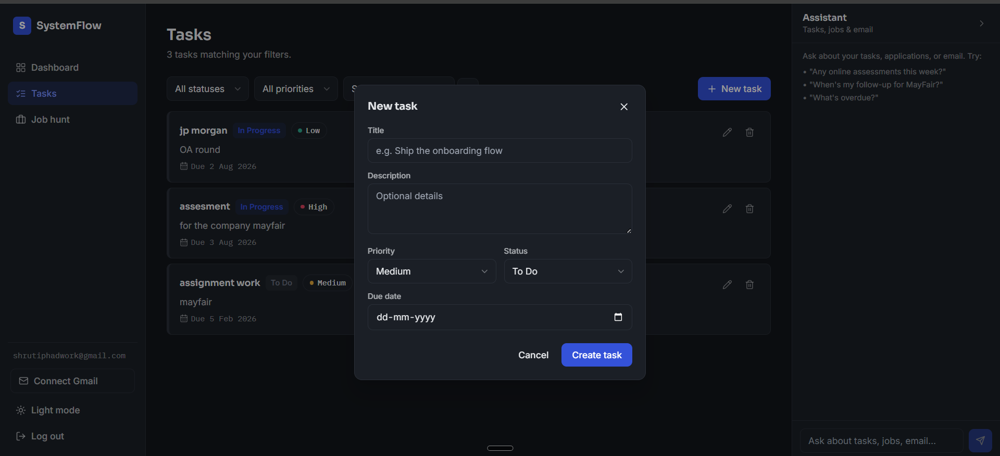

# SystemFlow — AI-Native Task, Job-Hunt & Email Assistant

A full-stack productivity platform that unifies **task management**, a **job-application tracker**, and an **AI assistant** that answers natural-language questions across your tasks, job pipeline, and connected Gmail inbox. Built as a cleanly separated React + Express + PostgreSQL application, extended in three additive phases without modifying the tested core.

**Live demo:** `<FILL IN: https://your-frontend.vercel.app>`
**Demo login:** `demo@systemflow.dev` / `<FILL IN: demo password>`

> **AI tool disclosure:** built with Claude (Anthropic) as a pair-programming assistant. Every design decision and line of code is one I can explain in a follow-up interview.

---

## 1. Overview

SystemFlow started as a task manager and grew into an AI-native productivity system. It keeps a **clear separation between frontend and backend** — a React SPA talking to a standalone Express REST API over HTTP — and layers three AI-powered features on top, each built as an additive phase so the original, fully-tested task manager never changed.

The defining idea: a language model sits over your data, but **never gets raw database access.** It calls a fixed set of per-user-scoped tool functions; the backend runs the actual queries; ownership is enforced server-side on every call. The same principle governs the read-only Gmail integration.

| | |
|---|---|
| **Frontend (Vercel)** | `<FILL IN: https://your-frontend.vercel.app>` |
| **Backend API (Render)** | `<FILL IN: https://your-backend.onrender.com>` |
| **Database** | PostgreSQL (Render managed Postgres) |
| **LLM** | Groq — `llama-3.3-70b-versatile` (tool-calling) |

---

## 2. Tech stack

| Layer | Choice | Why |
|---|---|---|
| Frontend | React 18 + Vite | Fast dev/build; explicit client/backend boundary |
| State | React Context (auth, theme) + Zustand (tasks, jobs, chat, gmail) | Context for rarely-changing global state; Zustand stores for data that updates frequently |
| Styling | Tailwind CSS | Utility-first design system with dark mode |
| Forms / validation | React Hook Form + Zod | Client-side validation mirroring server rules |
| Backend | Node.js + Express | REST API with middleware-based auth, validation, error handling |
| Database | PostgreSQL + Sequelize ORM | Relational integrity, indexes, enum types |
| Auth | JWT (stateless) + bcrypt | Token-based auth; hashed passwords |
| AI | Groq SDK (tool-calling) | Fast, cheap LLM; the model calls fixed tools, never the DB directly |
| Email | Google Gmail API (`gmail.readonly`) | Read-only inbox search; OAuth tokens encrypted at rest |
| Deployment | Vercel (frontend) + Render (backend + Postgres) | Standard split-deployment pattern |

---

## 3. Features

### Core — Task management
- JWT auth: registration with validation, login, protected routes, logout
- Full task CRUD: title, description, priority (Low/Medium/High), due date, status (To Do / In Progress / Done)
- Filter by status/priority, sort by due date or creation date
- Delete with confirmation
- Dashboard: total tasks, breakdown by status, overdue count (aggregated in the DB)
- Colour-coded priorities, responsive layout, dark mode

### Phase 1 — AI assistant (chat sidebar)
- A floating assistant that answers questions about your own tasks and jobs in natural language
- The LLM never touches the database — it selects from fixed, named **tools** (search by company, get overdue/upcoming, counts by status, follow-ups, etc.); the backend runs the real, per-user-scoped query
- User identity is injected server-side from the auth token — never exposed to the model, so it cannot request another user's data

### Phase 2 — Job-hunt tracker (Kanban)
- A pipeline board: Wishlist → Applied → Online Assessment → Interviewing → Offer → Rejected → Withdrawn
- Drag-and-drop between stages (optimistic UI, rolls back on failure), via a dedicated status endpoint
- Rich application records: company, role, portal/source, location, salary range, outreach flag, applied/follow-up dates, notes, and a 1–5 excitement rating
- Job-aware assistant tools (e.g. "which companies need follow-up?", "do I have any offers?")

### Phase 3 — Gmail connector
- Connect a Gmail account (**read-only** scope) from the sidebar
- Ask the assistant about your actual inbox — which companies you emailed, whether you've had replies — via a live Gmail search the LLM constructs using Gmail's own operators
- OAuth tokens are **encrypted at rest** (AES-256-GCM); only metadata + snippets are read, never full bodies stored

---

## 4. Screenshots

| Job-hunt board + AI assistant | Tasks + assistant |
|---|---|
|  |  |

> Save your uploaded screenshots into a `docs/` folder as `screenshot-jobhunt.png` and `screenshot-tasks.png` so these render on GitHub. Consider adding a short demo GIF of the assistant answering a live question — it's the most impressive thing to show.

---

## 5. Project structure

```
systemflow/
├── client/                     # React + Vite frontend
│   └── src/
│       ├── api/                 # axios (JWT interceptors) + auth/task/job/chat/gmail wrappers
│       ├── context/             # AuthContext, ThemeContext
│       ├── store/               # taskStore, jobStore, chatStore, gmailStore (Zustand)
│       ├── components/          # Navbar, TaskCard, JobCard, ChatSidebar, GmailConnect, modals, etc.
│       └── pages/               # Login, Register, Dashboard, Tasks, JobHunt
├── server/                      # Express + PostgreSQL backend
│   ├── src/
│   │   ├── config/               # Sequelize connection
│   │   ├── models/               # User, Task, JobApplication, GmailConnection
│   │   ├── middleware/           # auth, validation, centralized error handling
│   │   ├── controllers/          # auth, task, dashboard, chat, jobApplication, gmail
│   │   ├── routes/
│   │   ├── services/             # groq.client, chatTools, gmail.client
│   │   └── utils/                # jwt, asyncHandler, crypto (AES-256-GCM)
│   ├── seed/                     # demo user + sample data
│   └── tests/                    # Jest + Supertest integration tests
├── .github/workflows/ci.yml
├── docker-compose.yml
└── ARCHITECTURE.md
```

---

## 6. Local setup

### Prerequisites
- Node.js 20+
- PostgreSQL 14+ running locally

### Backend
```bash
cd server
cp .env.example .env          # fill in DB_*, JWT_SECRET, CLIENT_ORIGIN (see section 7)
npm install
npm run seed                   # optional: demo user + sample tasks/jobs
npm run dev                    # http://localhost:5000
```

### Frontend
```bash
cd client
cp .env.example .env           # set VITE_API_URL=http://localhost:5000/api
npm install
npm run dev                    # http://localhost:5173
```

### One-command startup (Docker)
```bash
docker compose up --build
```

> **Note:** the core app (tasks + jobs) runs with **no AI setup**. The assistant needs `GROQ_API_KEY`; the Gmail connector needs the Google OAuth vars. Without them, the app still runs — the assistant reports "not configured" and Gmail stays disconnected.

---

## 7. Environment variables

**server/.env**
| Variable | Required | Description |
|---|---|---|
| `PORT` | no | Server port (default 5000) |
| `NODE_ENV` | no | `development` / `production` / `test` |
| `DB_HOST`, `DB_PORT`, `DB_NAME`, `DB_USER`, `DB_PASSWORD` | yes | Postgres details (local dev) |
| `DATABASE_URL` | (prod) | Single connection string; overrides `DB_*` (Render managed Postgres) |
| `JWT_SECRET` | yes | Secret for signing JWTs |
| `JWT_EXPIRES_IN` | no | Token lifetime, e.g. `7d` |
| `CLIENT_ORIGIN` | yes | Comma-separated allowed CORS origins (the Vercel URL in prod) |
| `GROQ_API_KEY` | for chat | Groq API key (console.groq.com) |
| `GROQ_CHAT_MODEL` | no | Defaults to `llama-3.3-70b-versatile` |
| `GOOGLE_CLIENT_ID`, `GOOGLE_CLIENT_SECRET` | for Gmail | Google OAuth credentials |
| `GOOGLE_REDIRECT_URI` | for Gmail | e.g. `http://localhost:5000/api/integrations/gmail/callback` |
| `TOKEN_ENCRYPTION_KEY` | for Gmail | 64-char hex (32 bytes) for AES-256-GCM token encryption |

**client/.env**
| Variable | Description |
|---|---|
| `VITE_API_URL` | Base URL of the backend API |

> Gmail setup (Google Cloud OAuth) is documented step-by-step in `GMAIL_SETUP.md`.

---

## 8. API reference

All routes prefixed with `/api`. Protected routes require `Authorization: Bearer <token>`.

### Auth
| Method | Route | Auth | Notes |
|---|---|---|---|
| POST | `/auth/register` | – | `{ name, email, password }`; returns `{ token, user }` |
| POST | `/auth/login` | – | `{ email, password }`; returns `{ token, user }` |
| GET | `/auth/me` | yes | current user (re-validates a stored token) |
| POST | `/auth/logout` | yes | stateless |

### Tasks
| Method | Route | Auth | Notes |
|---|---|---|---|
| GET | `/tasks?status=&priority=&sortBy=&order=` | yes | filter + sort |
| GET | `/tasks/:id` | yes | 404 if not the caller's |
| POST | `/tasks` | yes | create |
| PUT | `/tasks/:id` | yes | update (partial) |
| DELETE | `/tasks/:id` | yes | delete |
| GET | `/dashboard/summary` | yes | `{ total, byStatus, overdue }` |

### Jobs
| Method | Route | Auth | Notes |
|---|---|---|---|
| GET | `/jobs?status=` | yes | all applications (board groups client-side) |
| GET | `/jobs/:id` | yes | single application |
| POST | `/jobs` | yes | create |
| PUT | `/jobs/:id` | yes | update |
| PATCH | `/jobs/:id/status` | yes | lightweight status change (Kanban drag) |
| DELETE | `/jobs/:id` | yes | delete |

### Assistant (chat)
| Method | Route | Auth | Notes |
|---|---|---|---|
| POST | `/chat` | yes | `{ message, history? }` → `{ reply }`; runs the tool-calling loop |

### Gmail integration
| Method | Route | Auth | Notes |
|---|---|---|---|
| GET | `/integrations/gmail/status` | yes | connection status |
| GET | `/integrations/gmail/connect` | yes | returns Google consent URL |
| GET | `/integrations/gmail/callback` | (state) | OAuth callback (authenticated via signed state) |
| DELETE | `/integrations/gmail` | yes | disconnect |

**Status codes:** `200/201` success, `400` validation, `401` auth, `404` not found, `409` conflict, `503` chat not configured, `500` unexpected.

---

## 9. Database design

Four tables, all user-scoped with `ON DELETE CASCADE`:
- **users** — bcrypt-hashed passwords, unique-indexed email
- **tasks** — UUID PK, ENUM priority/status, `DATE` due date, composite index `(user_id, status, due_date)`
- **job_applications** — sibling of tasks; ENUM pipeline `status`, free-text `portal`, excitement rating, follow-up dates
- **gmail_connections** — one per user; **encrypted** OAuth tokens (never plaintext), unique-indexed on `user_id`

Full rationale (schema, auth flow, LLM tool-calling safety, trade-offs) is in `ARCHITECTURE.md`.

---

## 10. Testing

```bash
cd server && npm test        # backend: Jest + Supertest vs real PostgreSQL
cd client && npm test        # frontend: Vitest + Testing Library (rendered, vs live backend)
```
Integration tests run against a **real database**, not mocks. They cover auth, task and job CRUD, filtering, dashboard aggregation, and — critically — **ownership isolation** across every entity (proving one user cannot access another's tasks, jobs, or chat results). The frontend tests render the actual app and drive it with real interactions, including the chat tool-calling loop and the Gmail not-connected path.

---

## 11. CI/CD

**GitHub Actions** (`.github/workflows/ci.yml`) on every push and PR:
- Backend job: PostgreSQL service container + full backend test suite
- Frontend job: PostgreSQL + live backend + rendered frontend tests, then a production build

A red pipeline blocks broken code from merging.

---

## 12. Deployment

- **Frontend → Vercel:** root `client/`, set `VITE_API_URL` to the Render backend URL.
- **Backend → Render:** Web Service from `server/`, Render managed PostgreSQL, set `DATABASE_URL`, `JWT_SECRET`, `CLIENT_ORIGIN`, and (for AI) `GROQ_API_KEY` + the Google/token vars. `sequelize.sync()` creates the schema on first boot.
- **Gmail OAuth in production:** add the deployed backend callback URL (`https://<your-backend>/api/integrations/gmail/callback`) to the authorized redirect URIs in Google Cloud.

---

## 13. Security & design decisions

- **LLM never touches the DB** — it calls fixed, per-user-scoped tools; identity is injected server-side, never exposed to the model.
- **Ownership everywhere** — every query filters by the authenticated user; verified by automated isolation tests.
- **Gmail is read-only** and OAuth tokens are encrypted at rest (AES-256-GCM, authenticated encryption).
- **OAuth CSRF protection** via a short-lived signed state token.
- Documented trade-offs (localStorage JWT vs httpOnly cookies, `sequelize.sync` vs migrations) in `ARCHITECTURE.md`.

Built in three additive phases — the core task manager's tests never broke as each AI feature was layered on.